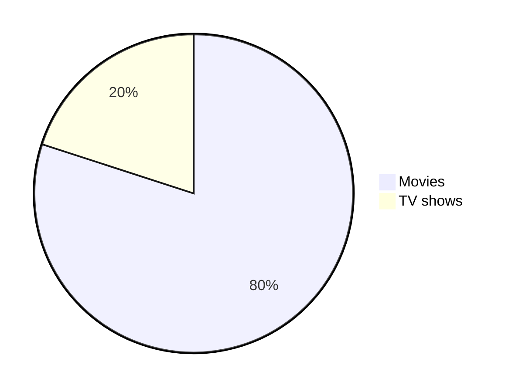

CHEATSHEET
<kbd>   [Markdown-Cheatsheet](https://github.com/lifeparticle/Markdown-Cheatsheet)   </kbd>

### Building the Docker Image

    Save the Dockerfile in a directory.
    Open a terminal and navigate to the directory containing the Dockerfile.
    Build the Docker image using the following command:

Email at example@example.com    
<https://github.com/>

