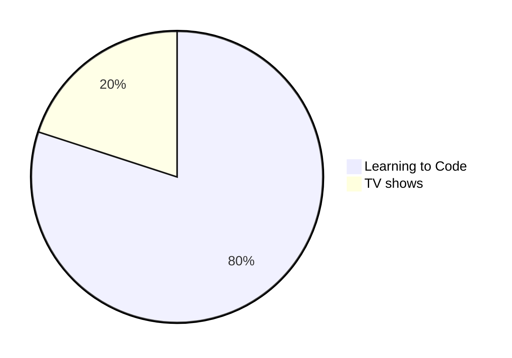

CHEATSHEET
<kbd>   [Markdown-Cheatsheet](https://github.com/lifeparticle/Markdown-Cheatsheet)   </kbd>

### Building the Docker Image

    Save the Dockerfile in a directory.
    Open a terminal and navigate to the directory containing the Dockerfile.
    Build the Docker image using the following command:

Email at example@example.com    
<https://github.com/>

> [!NOTE]
> Essential details that users should not overlook, even when browsing quickly.

 

> [!TIP]
> Additional advice to aid users in achieving better outcomes.

 

> [!IMPORTANT]
> Vital information required for users to attain success.

 

> [!WARNING]
> Urgent content that requires immediate user focus due to possible risks.

 

> [!CAUTION]
> Possible negative outcomes resulting from an action.
